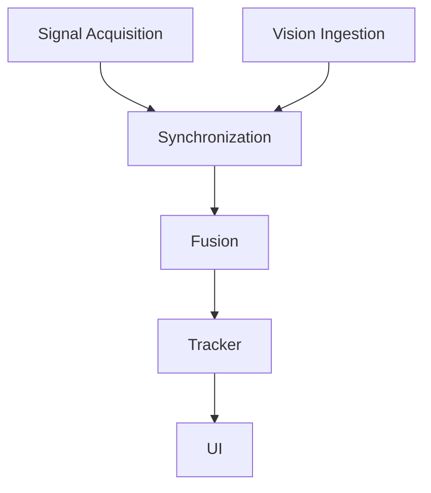

# Architecture Overview

## Modules

1. **Signal Acquisition**
   - Captures raw sensor inputs (IMU, GPS, wheel odometry, CAN bus, etc.).
   - Provides calibrated measurements and health/status flags.
2. **Vision Ingestion**
   - Ingests camera frames and runs pre-processing (undistortion, resizing).
   - Extracts features or detections needed by downstream modules.
3. **Synchronization**
   - Aligns asynchronous sensor streams to a common time base.
   - Handles buffering, interpolation, and latency compensation.
4. **Fusion**
   - Combines synchronized signals into a unified state estimate.
   - Produces global pose, velocity, and uncertainty estimates.
5. **Tracker**
   - Tracks objects and ego-state over time using fused inputs.
   - Maintains track identities, lifetimes, and confidence.
6. **UI**
   - Visualizes state, tracks, and diagnostics for operators.
   - Provides playback and debugging tools.

## Interfaces Between Modules

### Data Schemas
- **SensorFrame**
  - `sensor_id: string`
  - `timestamp_ns: int64`
  - `payload: bytes | structured fields`
  - `status: { ok: bool, error_code?: string }`
- **VisionFrame**
  - `camera_id: string`
  - `timestamp_ns: int64`
  - `image: bytes | gpu_buffer_handle`
  - `intrinsics: { fx, fy, cx, cy }`
  - `distortion: [k1, k2, p1, p2, k3]`
- **SyncPacket**
  - `timestamp_ns: int64`
  - `sensors: SensorFrame[]`
  - `vision: VisionFrame[]`
- **FusionState**
  - `timestamp_ns: int64`
  - `pose: { position_m, orientation_quat }`
  - `velocity_mps: [vx, vy, vz]`
  - `covariance: float[]`
- **TrackSet**
  - `timestamp_ns: int64`
  - `tracks: [{ id, class, pose, velocity, confidence }]`

### Timestamps
- Use **monotonic nanoseconds** (`timestamp_ns`) across all modules.
- Synchronization uses a **common time base** anchored at acquisition time.
- Fusion and tracking outputs are stamped with the **aligned** timestamp.

### Coordinate Systems
- **Sensor frame**: sensor-local coordinate system (document per sensor).
- **Vehicle frame**: right-handed, X forward, Y left, Z up.
- **World frame**: ENU (East-North-Up) or map-projected coordinates.
- Transformation chain: `sensor -> vehicle -> world`.

## MVP Pipeline (Phase 1)

1. **Signal Acquisition (MVP)**
   - Read IMU + GPS + wheel odometry.
   - Output `SensorFrame` packets.
2. **Vision Ingestion (MVP)**
   - Capture camera frames with timestamps.
   - Output `VisionFrame` packets.
3. **Synchronization (MVP)**
   - Buffer and align sensor + vision streams.
   - Output `SyncPacket` at fixed rate.
4. **Fusion (MVP)**
   - Basic EKF/UKF to estimate ego-state.
   - Output `FusionState`.
5. **Tracker (MVP)**
   - Simple track initialization and maintenance.
   - Output `TrackSet`.
6. **UI (MVP)**
   - Display ego trajectory, tracks, and sensor status.

### Future Placeholders
- **Signal Acquisition**: add lidar, radar, high-rate IMU, V2X feeds.
- **Vision Ingestion**: onboard detection models, semantic segmentation.
- **Synchronization**: hardware time sync (PTP), clock drift correction.
- **Fusion**: multi-sensor SLAM, map-based localization.
- **Tracker**: multi-modal tracking, intent prediction.
- **UI**: scenario replay, anomaly alerts, remote dashboards.

## MVP Pipeline Diagram

## Required External Dependencies

- **Sensor SDKs**: vendor libraries for IMU/GPS/odometry.
- **Camera SDK**: frame capture and hardware timestamp support.
- **Time Sync**: PTP client/daemon (future hardware sync).
- **Math/Estimation**: linear algebra + filtering library.
- **Serialization**: protobuf/flatbuffers or equivalent.
- **Visualization**: UI framework (web or native) and plotting.
